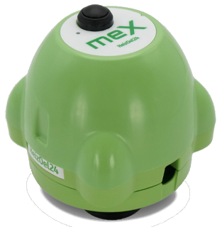

# ioBroker.heizoel24-mex

## heizoel24-mex adapter for ioBroker

Der MEX ist ein Heizoelstandsmessgerät. Dieser Adapter liest die MEX Daten vom Heizoel24 Server.

Siehe: https://www.heizoel24.de/mex

## Benutzung:
Lediglich Login Daten vom Heizoel24 Account eintragen (Email und Passwort).
Die MEX Daten werden im Datenpunkt heizoel24-mex gespeichert.
Der Adapter startet standardmässig alle 3 Stunden. Das ist völlig ausreichend, da der MEX nur einmal im Tag Daten versendet.
Die Datei CalculatedRemaining/CalculatedRemainingJson (Berechnete Restmenge) kann direkt mit eCharts geöffnet werden.

## License
MIT License

Copyright (c) 2024 Daniel Luginbühl <webmaster@ltspiceusers.ch>

